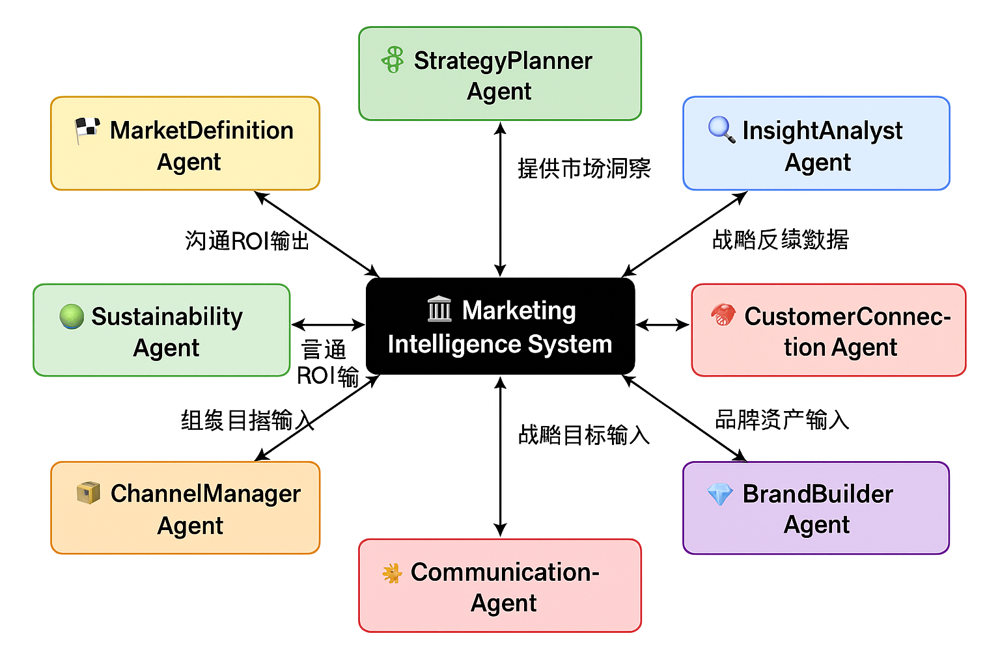

# 🤖 Marketing Management Agents  
### *An Intelligent Multi-Agent System based on Philip Kotler’s Marketing Management*

---

## 🧭 Project Overview

**Kotler Marketing Agents** 是一个基于菲利普·科特勒《营销管理》（Marketing Management, 15th/16th Edition）构建的  
**多智能体营销战略系统（Multi-Agent Marketing Framework）**。  

每个 Agent 代表营销体系中的一个核心职能，  
通过精细化的 Prompt 与章节知识库（原文 + 总结）实现自动化战略推理与市场洞察生成。

---

## 📘 System Architecture

本项目由多个 **Domain-Specific Agents** 组成，  
每个智能体代表一个营销领域，具备独立知识库、Prompt 与任务逻辑。




| Agent 名称                     | 对应章节  | 职能定位                         | 知识文件                          |
| ------------------------------ | --------- | -------------------------------- | --------------------------------- |
| 🏁 **MarketDefinition Agent**   | 第1–3章   | 市场定义、需求分析、环境扫描     | `ch01.pdf` `ch01_summary.txt` ... |
| 🧩 **StrategyPlanner Agent**    | 第4–6章   | 营销战略制定、STP分析、竞争策略  | `ch04.pdf` `ch04_summary.txt` ... |
| 🔍 **InsightAnalyst Agent**     | 第7–8章   | 消费者行为与市场调研分析         | `ch07.pdf` `ch07_summary.txt` ... |
| 🤝 **CustomerConnection Agent** | 第9–12章  | 客户关系、品牌忠诚与体验管理     | `ch09.pdf` `ch09_summary.txt` ... |
| 💎 **BrandBuilder Agent**       | 第13–16章 | 品牌资产建设、产品策略与价值塑造 | `ch13.pdf` `ch13_summary.txt` ... |
| 📦 **ChannelManager Agent**     | 第17–18章 | 渠道与分销系统设计、零售与供应链 | `ch17.pdf` `ch17_summary.txt` ... |
| 📡 **CommunicationAgent**       | 第19–22章 | 整合传播、广告、公关、促销、CRM  | `ch19.pdf` `ch19_summary.txt` ... |
| 🌍 **SustainabilityAgent**      | 第23章    | 可持续发展、CSR、社会营销与伦理  | `ch23.pdf` `ch23_summary.txt`     |

---

## 🧠 Knowledge Structure

每个章节包含两类知识文件：

| 文件类型           | 描述                                                      |
| ------------------ | --------------------------------------------------------- |
| `chXX.pdf`         | 原始书籍章节文本（英文或扫描版）                          |
| `chXX_summary.txt` | 提炼总结（框架、模型、案例、策略）                        |
| `Agent_prompt.txt` | 对应智能体的 Prompt 模板，用于在 Coze 或 LLM 平台构建角色 |

知识文件上传后会作为各 Agent 的「长期知识库」，  
通过 Prompt + Retrieval 实现章节级推理与跨领域协同。

---

## 🧩 Agent Function Overview

### 🏁 MarketDefinition Agent
- 目标：识别市场与顾客需求、定义营销机会  
- 能力：SWOT / PESTEL / 市场划分 / 需求预测  
- 输出：市场细分报告、目标机会地图  

### 🧩 StrategyPlanner Agent
- 目标：制定市场战略与竞争定位  
- 能力：STP 模型、五力分析、价值主张设计  
- 输出：战略框架、竞争地图、目标选择建议  

### 🔍 InsightAnalyst Agent
- 目标：洞察顾客行为与心理驱动  
- 能力：消费者决策路径、数据分析、调研设计  
- 输出：行为洞察、Persona 报告  

### 🤝 CustomerConnection Agent
- 目标：建立长期顾客关系与体验闭环  
- 能力：CRM、客户满意度、生命周期价值分析  
- 输出：忠诚度提升策略、体验优化方案  

### 💎 BrandBuilder Agent
- 目标：构建品牌资产与价值体系  
- 能力：品牌识别、品牌金字塔、延伸策略  
- 输出：品牌定位图、资产评估报告  

### 📦 ChannelManager Agent
- 目标：设计高效渠道网络与零售体系  
- 能力：供应链优化、渠道冲突管理、物流整合  
- 输出：渠道策略蓝图、分销绩效分析  

### 📡 CommunicationAgent
- 目标：整合传播体系，优化广告与CRM策略  
- 能力：IMC、广告、公关、促销、数字传播  
- 输出：传播计划书、媒体组合建议、内容策略  

### 🌍 SustainabilityAgent
- 目标：实现长期可持续与社会责任营销  
- 能力：CSR、ESG、内部文化、社会营销、伦理管理  
- 输出：可持续发展战略、公益品牌计划  

---

## 🧮 System Workflow

```mermaid
flowchart TD
    A[知识文件上传] --> B[Agent Prompt 构建]
    B --> C[知识库索引创建]
    C --> D[多Agent协同执行]
    D --> E[输出：策略报告 / 框架分析 / 案例洞察]


